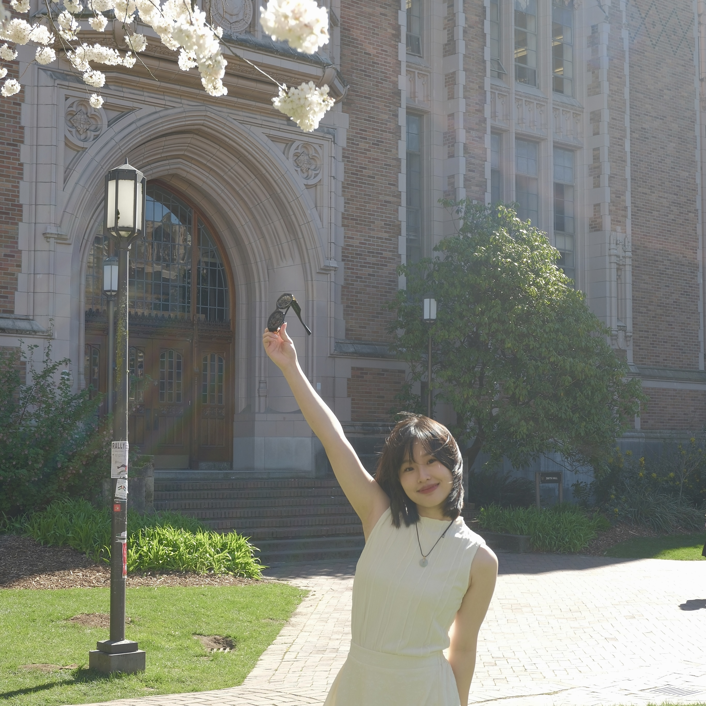

# Jiayi

Welcome to connect my Linkedin: [Linkedin](https://www.linkedin.com/in/jiayi-ge-866a79299/)

# Jiayi's Resume

## Education

### University of Washington | Bachelor of Art & Science

2020–2024 | BS: Economics

BA: Food System, Nutrition, and Health

GPA:3.8

Dean s List: Autumn 2021, Winter 2022, Autumn 2022 Current

### Columbia University | Mailman School of Public Health

2024-2026 - Master of Science in Biostatistics - Theory and Methods

## Professional Experience

### IQVIA | Data Analyst
Jun. 2023–Aug. 2023 | Remote 

* Examined and organized the acquired data to ensure accuracy and completeness.

* Instantiated multiple machine learning models, including logistic regression, decision trees, and k-nearest neighbors, to assess model performance effectively.

* Built the Web Application with Flask Framework; achieved interactive functionality that allowed users to test and forecast customized outcomes.

### iUrbanTeen | Group project leader
Jan. 2024–June. 2024 | Seattle

* Collaborated with Rainier Community Center to create a STEM-focused hydroponic garden. 

* This project aims to provide educational opportunities and bridge the equity gap for the BIPCO community.

## Academic Experience
### TogEdher | Group Project
Jun. 2021–July. 2021 | Seattle, WA

* Design a learning platform and methodology suitable for primary and secondary school students in impoverished areas of China during the COVID pandemic when on-site education became inaccessible. 

### MyPlan Redesign | Individual Project
Mar. 2022–May. 2022 | Seattle, WA

* Redesigned the current course registration system of UW, giving it a cleaner and more aesthetically appealing design.